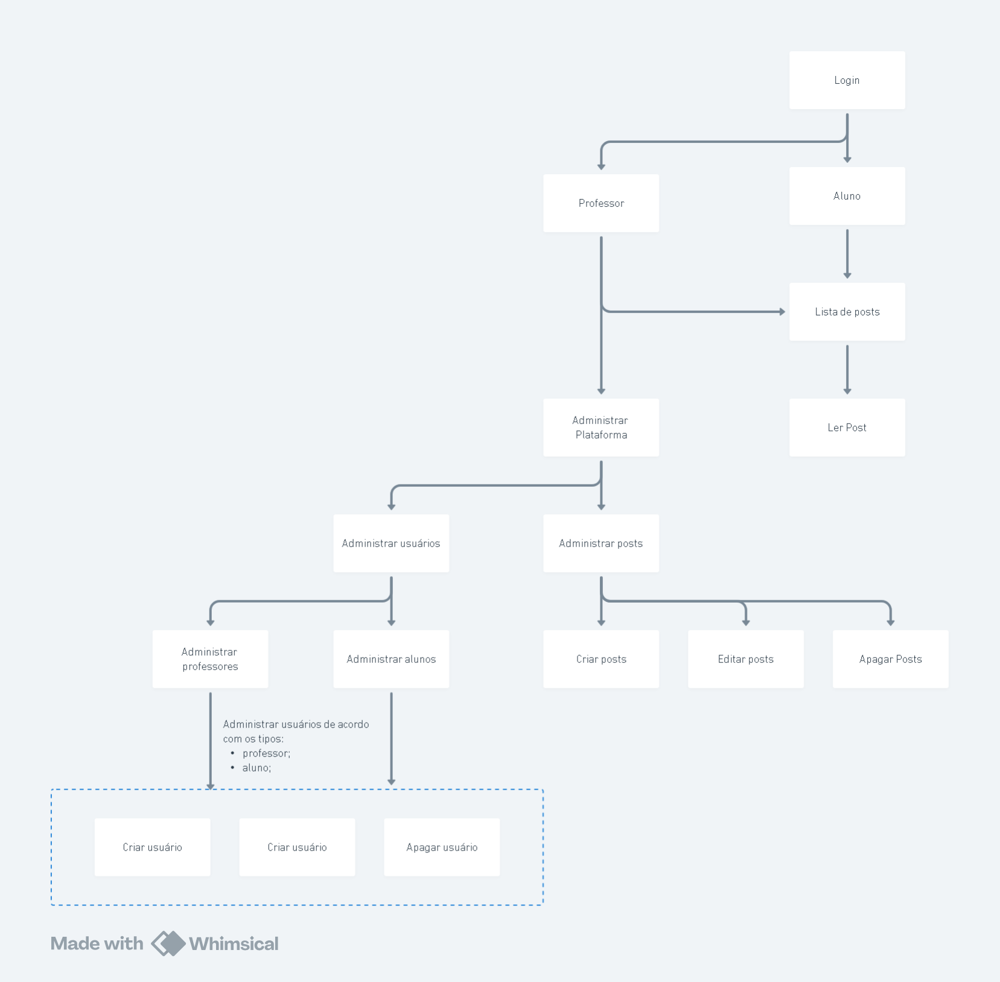

# App de visualização e adminstração de posts

Este App se propõe a implementar o front-end de uma aplicação em formato de Blogging voltado para que professores disponibilizem conteúdos escritos para os seus alunos.

Portanto o App visa fornecer os recursos necessários para a manipulação dos dados dos posts e dos usuários da plataforma.

Esta aplicação foi desenvolvida visando cumprir os requisitos estabelecidos pelo Tech-Challenge da Pós-Tech em Desenvolvimento Full-Stack da FIAP.

## Estrutura das páginas e guia de uso

Este aplicativo é composto por 11 telas, que serão detalhadas abaixo, e estão ilustradas no diagrama desta seção:



- **Login:** Esta é a tela onde o usuário insere seu e-mail e senha para conseguir acessar todos os recursos do app, para conseguir acessar é necessário que o usuário tenha sido cadastrado anteriormente na base de dados através da api do projeto;
- **Lista de Post:** Esta é a tela onde o usuário tem acesso a lista de posts da plataforma e pode realizar pesquisas pelo conteúdo e pelo título do post.
- **Ler Post:** Ao clicar no post da lista, o usuário é direcionado para esta tela, onde é possível visualizar o conteúdo que foi cadastrado pelo professor.
- **Gerenciar sistema:** Nesta tela, o usuário que possui o cadastro de "professor" terá acesso aos recuros para gerenciar a plataforma:
  - Gerenciar usuários
  - Gerenciar posts
- **Gerenciar usuários:** Nesta tela o professor poderá escolher entre:
  - Gerenciar professores
  - Gerenciar alunos
- **Gerenciar professores:** Nesta tela o professor poderá visualizar uma lista dos professores cadastrados na plataforma e poderá deletá-los da plataforma, editá-los ou cadastrar um novo professor;
- **Gerenciar alunos:** Nesta tela o professor poderá visualizar uma lista dos alunos cadastrados na plataforma e poderá deletá-los da plataforma, editá-los ou cadastrar um novo aluno
- **Cadastrar/Editar professor:** Nesta tela o professor poderá inserir os dados para cadastrar um professor ou para editar seus dados;
- **Cadastrar/Editar aluno:** Nesta tela o professor poderá inserir os dados para cadastrar um aluno ou editar seus dados;
- **Gerenciar posts:** Nesta tela o professor poderá acessar a lista de posts da plataforma e poderá criar um novo post, deletá-los ou selecionar um post para editar;
- **Cadastrar/Editar post:** Nesta tela o professor poderá tanto editar quanto criar um novo post na plataforma.


## Tecnologias do app


Para a construção do aplicativo foram utilizadas as tecnologias listadas abaixo:
- **React Native:** Framework para a criação de aplicativos móveis híbridos, permitindo a execução tanto em dispositivos Android quanto iOS, utilizando JavaScript e React.
- **Expo:** Plataforma que simplifica o desenvolvimento com React Native, oferecendo um conjunto de ferramentas para facilitar a criação, compilação e depuração do aplicativo sem a necessidade de configuração manual do ambiente nativo.
- **Firebase:** Serviço utilizado para gerenciar a autenticação do sistema, fornecendo login seguro através de diversos provedores, como e-mail/senha, Google, Facebook, entre outros.
- **Styled Components:** Biblioteca utilizada para a estilização dos componentes da aplicação, permitindo a criação de estilos dinâmicos e modulares com CSS-in-JS.
- **Axios:** Cliente HTTP baseado em Promises utilizado para realizar requisições à API do projeto, permitindo a comunicação eficiente entre o aplicativo e o backend.


## Arquitetura da aplicação


A arquitetura do aplicativo é dividida em três principais componentes:

- **App (Front-end):** Representa a interface gráfica com a qual o usuário interage. O aplicativo é responsável por se comunicar com o serviço de autenticação e a API, garantindo a recuperação e exibição adequada dos dados conforme o contexto de uso.
- **Autenticação:** O gerenciamento de autenticação é realizado pelo Firebase Authentication, que controla o acesso dos usuários à plataforma. Toda a lógica relacionada ao login, criação de contas e autenticação é processada diretamente pelo Firebase, garantindo segurança e confiabilidade.
- **API (Back-end):** Responsável pelo armazenamento e gerenciamento dos dados da aplicação. Isso inclui os posts publicados na plataforma, além de informações dos usuários, como permissões de acesso a diferentes recursos do sistema.

## Setup para aplicação:

Primeiramente é necessária a configuração e execução do projeto da API, que está disponível no repositório:

https://github.com/BernardoS/tc-posts-api

Após a configuração do back-end da aplicação com a API, certifique-se de que o container está sendo executado antes de iniciar a aplicação.

Para iniciar siga os passos abaixo:

Clone o projeto :

`git clone https://github.com/BernardoS/tc-posts-app.git`

Instale o expo-cli (Não é obrigatório mas é recomendado):

`npm install -g expo-cli`

Instale as dependencias do projeto:

`npm install`

Execute o projeto com o comando:

`expo start`
ou
`npx expo start`

OBS.: Recomenda-se o uso do aplicativo Expo Go para executar o projeto:

- Para rodar no celular:

    1 - Instale o Expo Go na Play Store ou App Store.
    2 - Escaneie o QR Code exibido no terminal ou no navegador.


## Configuração das variáveis de ambiente

Para o correto funcionamento da autenticação do app é necessária a configuração de um arquivo `.env` com as seguintes variáveis, que podem ser obtidas no seu projeto do firebase (exceto a variável `API_BASE_URL` que deve conter a url para se conectar ao back-end da aplicação);

```
    EXPO_PUBLIC_FIREBASE_API_KEY=
    EXPO_PUBLIC_FIREBASE_AUTH_DOMAIN=
    EXPO_PUBLIC_FIREBASE_PROJECT_ID=
    EXPO_PUBLIC_FIREBASE_STORAGE_BUCKET=
    EXPO_PUBLIC_FIREBASE_MESSAGING_SENDER_ID=
    EXPO_PUBLIC_FIREBASE_APP_ID=
    API_BASE_URL=
```
--------
## Experiências e desafios do desenvolvimento

🚀 **Execução do Back-end e Front-end no Mesmo Computador**
Um dos principais desafios enfrentados foi a limitação de memória RAM ao rodar simultaneamente o back-end (em um container) e o front-end no mesmo computador. Isso dificultava o desenvolvimento, pois o consumo de recursos comprometia o desempenho da máquina.

💡 **Solução adotada:** Para contornar esse problema, o aplicativo foi testado diretamente no Expo Go instalado no celular do desenvolvedor, evitando a necessidade de rodar emuladores pesados no computador.

🔄 **Desafios na Navegação do React Native**
A escolha da navegação foi outro ponto crítico. O React Native oferece duas abordagens principais:

**expo-router:** Baseado em rotas semelhantes às do Next.js.
**react-navigation:** Mais tradicional e amplamente utilizado na comunidade.
No início, houve confusão sobre as diferenças e limitações de cada opção, o que impactou o processo de decisão.

💡 **Solução adotada:** Após pesquisas, testes e leitura aprofundada da documentação, foi possível compreender melhor os recursos de cada biblioteca e escolher a abordagem mais adequada ao projeto.

⚡ **Diferenças entre Hooks do React e do React Native**
Outro desafio foi lidar com os hooks específicos do React Native, que em alguns casos se comportam de maneira diferente dos hooks tradicionais do React. Isso causou dificuldades no gerenciamento de estados e efeitos colaterais.

💡 **Solução adotada:** A equipe aprofundou seus conhecimentos sobre os hooks nativos do React Native e suas particularidades, garantindo uma implementação mais eficiente e evitando problemas de reatividade.
